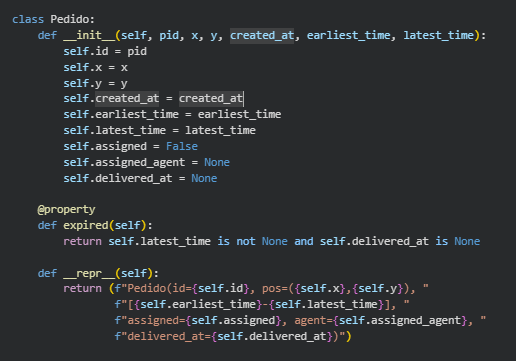
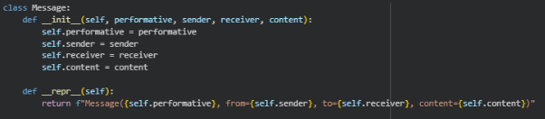
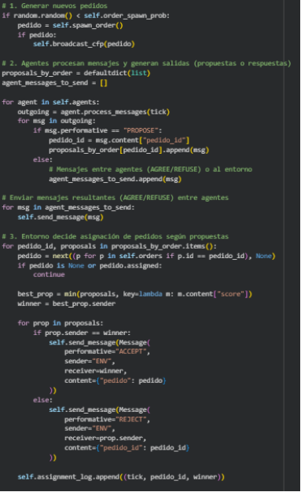
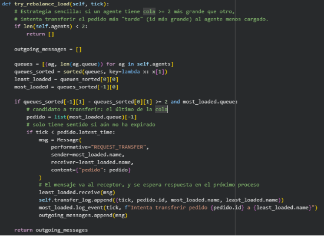
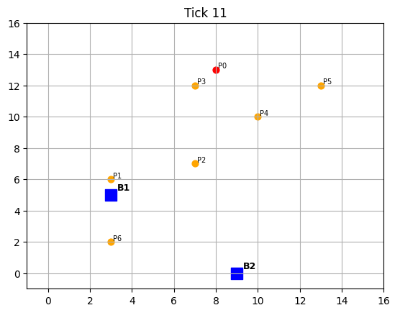
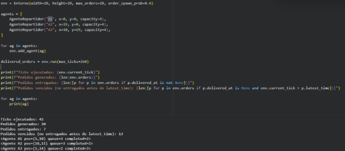
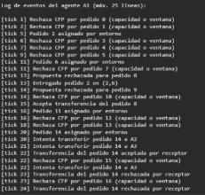
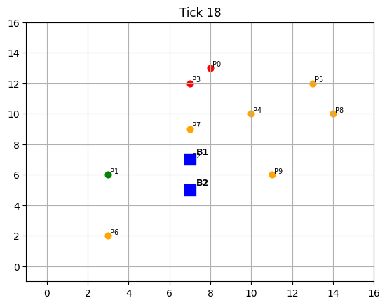

**UNIVERSIDAD PERUANA DE CIENCIAS APLICADAS**

**FACULTAD DE INGENIERÍA**

**CARRERA PROFESIONAL** 

**DE CIENCIAS DE LA COMPUTACIÓN**

**TÓPICOS DE CIENCIAS DE LA COMPUTACIÓN**

**Sección:  12625**

**INFORME DE TRABAJO FINAL**

**Autores**

- u202013066 Christian Joel Cutipa Cañapataña 
- u202112986 José Giovanni Laura Silvera

**Profesor**

Jairo Pinedo Taquia

Lima, noviembre de 2025

Tabla de contenidos 

[**1. Introducción	3**](#_kfkqkykcapix)

[1.1 Contexto del problema	3](#_gft2d1aszo9u)

[1.2 Planteamiento del problema	3](#_1sakatp4o42r)

[1.3 Motivación	4](#_qjirvo3a85rg)

[1.4 Solución propuesta	4](#_yj0vhv11tuch)

[**2. Marco teórico	4**](#_gfg3redi7zo7)

[2.1 Agentes inteligentes	5](#_pd7owsk2g9li)

[2.2 Sistemas Multiagente (SMA)	5](#_ma20kkuzeuv6)

[2.3 Comunicación basada en mensajes	6](#_cm5qoaunq0zu)

[2.4 Ventanas de tiempo (Time Windows)	6](#_wfqx1abqhzd7)

[**3. Desarrollo	7**](#_gxadmk170hxl)

[3.1 Obtención y preparación de datos	7](#_cle1cmlmf6yt)

[3.2 Preparación de modelos	8](#_l5mqa455n8mi)

[3.2.1 Clase Message: comunicación entre agentes	8](#_dxenhpz2stcr)

[3.2.2 Clase AgenteRepartidor: lógica y comportamiento autónomo	9](#_bpqsin7i75g7)

[3.2.3 Clase Entorno: gestión global y supervisión	10](#_jk2xj0mnjywb)

[**3.3 Implementación del prototipo	11**](#_cja82vro84rw)

[**3.4 Pruebas del sistema	12**](#_sod03llqk301)

[**4. Resultados	14**](#_4k2zugudu43r)

[4.1 Métricas generales de la simulación	14](#_io5n91qpfgi1)

[4.2 Distribución de trabajo por agente	14](#_m5a91w910fm3)

[4.3 Distancia recorrida por agente	15](#_biykz7w6467w)

[4.4 Estado final del mapa	16](#_9qap348dre4x)

[4.5 Log de comportamiento de los agentes	17](#_ig5augs0vnqq)

[4.6 Animación del comportamiento paso a paso	18](#_n2zi7fhowgd1)

[4.7 Interpretación general de los resultados	19](#_p2dgwg3vpi8d)

[**5. Conclusiones	19**](#_nxc0nxnimraq)

[**6. Repositorio	20**](#_nxc0nxnimasd)
##
##
##
##
##

# **1. Introducción**
La creciente demanda de servicios de reparto urbano —como delivery de alimentos, mensajería y logística de última milla— ha incrementado la necesidad de sistemas inteligentes capaces de asignar y coordinar entregas de forma eficiente. En entornos dinámicos y altamente variables, donde los pedidos surgen de manera continua y presentan restricciones de tiempo, las soluciones tradicionales de optimización centralizada suelen ser insuficientes debido a la alta complejidad, la incertidumbre y la naturaleza distribuida del problema.

Los **Sistemas Multiagente (SMA)** ofrecen un enfoque adecuado para este tipo de escenarios, ya que permiten modelar entidades autónomas (agentes) que perciben, deciden, actúan y se comunican entre sí para alcanzar objetivos individuales y colectivos. Esta arquitectura distribuida resulta especialmente útil cuando la información está fragmentada, el entorno cambia rápidamente o la toma de decisiones debe ser descentralizada.
## **1.1 Contexto del problema**
En un sistema real de reparto urbano, los repartidores deben recorrer una ciudad con una capacidad limitada, desplazarse físicamente por las calles y cumplir con ventanas de tiempo definidas para cada pedido. En estas condiciones, la coordinación entre múltiples repartidores es desafiante debido a factores como:

- Aparición dinámica de nuevos pedidos.
- Variación espacial de las distancias.
- Limitaciones de tiempo para cada entrega (ventanas temporales).
- Distribución desigual de carga entre repartidores.
- Posible congestión o superposición de rutas.

Una solución eficiente debe permitir que los repartidores asignen tareas de forma autónoma y colaborativa, evitando cuellos de botella y distribuyendo la carga de trabajo de manera razonable.
## **1.2 Planteamiento del problema**
¿Cómo asignar y coordinar múltiples pedidos entre varios repartidores autónomos, garantizando que las entregas se realicen dentro de un marco temporal válido, considerando restricciones de capacidad, distancias y dinámica del entorno?

Este problema presenta características típicas de entornos multiagente:

- Necesidad de **comunicación y negociación** entre entidades.
- Decisiones basadas en información parcial.
- Cambios constantes en el estado del entorno.
- Objetivo común, pero decisiones individuales.

Estas condiciones hacen que el problema sea ideal para abordarlo mediante **Sistemas Multiagente**, donde cada repartidor actúa de manera independiente pero al mismo tiempo colabora con los demás.
## **1.3 Motivación**
La motivación principal del presente trabajo es demostrar que un **Sistema Multiagente** puede resolver un escenario complejo de reparto urbano con ventanas de tiempo, mostrando:

- Autonomía en la toma de decisiones.
- Reactividad ante eventos del entorno (nuevos pedidos).
- Proactividad para completar entregas.
- Sociabilidad mediante comunicación con otros agentes.

Además, se busca mostrar cómo estos sistemas pueden adaptarse dinámicamente y gestionar situaciones de sobrecarga a través de **mecanismos de transferencia y negociación** entre agentes.
## **1.4 Solución propuesta**
Este trabajo propone un prototipo basado en **agentes inteligentes**, donde cada repartidor es modelado como una entidad autónoma con capacidad de:

- Recibir mensajes del entorno (CFP, ACCEPT, REJECT).
- Enviar propuestas basadas en su disponibilidad, distancia y ventana de tiempo.
- Transferir pedidos a otros agentes cuando se detecta un desbalance de carga.
- Moverse dentro de una representación simplificada de la ciudad para completar las entregas.

El entorno es responsable de:

- Generar pedidos dinámicamente.
- Gestionar las propuestas y adjudicar pedidos.
- Supervisar el rebalanceo en momentos de sobrecarga.

La simulación se implementó en Python mediante un notebook, incluyendo visualización paso a paso, métricas de desempeño y logs de comportamiento de cada agente, los cuales permiten analizar los efectos de la cooperación distribuida.
# **2. Marco teórico**
El sistema desarrollado en este proyecto se fundamenta en conceptos de agentes inteligentes, sistemas multiagente, comunicación basada en mensajes, y problemas de planificación y asignación con restricciones temporales. Esta sección presenta los elementos teóricos necesarios para comprender el comportamiento emergente del sistema y su relación con la solución implementada.
## **2.1 Agentes inteligentes**
Según la teoría clásica presentada por Russell y Norvig (2020), un **agente inteligente** es una entidad capaz de:

1. **Percibir** su entorno mediante sensores (inputs).
1. **Tomar decisiones** basadas en reglas, heurísticas o modelos internos.
1. **Actuar** modificando el estado del entorno mediante efectores o acciones.
1. **Perseguir objetivos** individuales o colectivos.

Un agente se considera racional si selecciona acciones que maximizan su desempeño de acuerdo con una función objetivo.

En este proyecto, cada repartidor se modela como un agente que:

- Percibe la aparición de nuevos pedidos.
- Evalúa si puede atenderlos considerando distancia, capacidad y ventana de tiempo.
- Decide ofertar o rechazar un pedido de manera autónoma.
- Actúa desplazándose paso a paso en el grid.
- Ajusta su carga mediante transferencias cuando el entorno lo requiere.

Estas propiedades reflejan **autonomía**, **proactividad**, **reactividad** y **sociabilidad**, características estándar de los agentes en sistemas inteligentes.
## **2.2 Sistemas Multiagente (SMA)**
Un Sistema Multiagente (SMA) es un conjunto de agentes que interactúan dentro de un entorno compartido. Se caracterizan por:

- **Descentralización**: no existe un único controlador global.
- **Distribución de información**: cada agente maneja una parte del conocimiento.
- **Comportamiento emergente**: el sistema exhibe dinámicas que no están programadas explícitamente en un solo agente.
- **Comunicación y cooperación**: los agentes intercambian mensajes para coordinar acciones.

En el contexto del reparto urbano:

- Cada agente representa un repartidor autónomo.
- El entorno genera pedidos, administra adjudicaciones y supervisa transferencias.
- Los agentes cooperan implícitamente resolviendo conflictos de asignación y explícitamente mediante transferencias de pedidos cuando existe desbalance de carga.

El sistema implementado muestra cómo reglas simples locales pueden generar comportamientos colectivos coherentes, como reparto equilibrado o rechazo racional de pedidos fuera de ventana.
## **2.3 Comunicación basada en mensajes**
La comunicación es esencial en los sistemas multiagente. Inspirados en los estándares FIPA ACL, los mensajes suelen incluir:

- **Performativa** (intención del mensaje), como:
  - CFP – *Call For Proposal*
  - PROPOSE – envío de una propuesta
  - ACCEPT / REJECT – adjudicación o rechazo
  - REQUEST\_TRANSFER – solicitud de transferencia
  - AGREE / REFUSE – respuesta a transferencia
- **Emisor**
- **Receptor**
- **Contenido** (información interna del mensaje)

En el prototipo:

- El **entorno** emite mensajes CFP para cada pedido nuevo.
- Los **agentes** responden con PROPOSE si pueden atenderlo.
- El entorno adjudica pedidos usando ACCEPT o REJECT.
- Entre agentes se usa REQUEST\_TRANSFER, AGREE y REFUSE para rebalancear carga.

Esta capa de comunicación permite:

- Resolver conflictos (múltiples agentes queriendo el mismo pedido).
- Distribuir trabajo de forma más equitativa.
- Manejar sobrecargas dinámicamente.
## **2.4 Ventanas de tiempo (Time Windows)**
El problema del reparto urbano con ventanas de tiempo es una variante del **Vehicle Routing Problem with Time Windows (VRP-TW)**. En esta formulación:

- Cada pedido posee un intervalo [earliest\_time, latest\_time].
- El agente debe llegar a la ubicación dentro de este marco temporal.
- Si el agente llega después del último tiempo permitido, el pedido se considera vencido.

Este trabajo incorpora ventanas de tiempo dinámicas, donde:

- Cada pedido define su ventana al ser creado.
- Los agentes estiman su tiempo de llegada considerando:
  - Distancia Manhattan.
  - Cantidad de pedidos pendientes.
- Solo proponen si la entrega es factible dentro de la ventana.

Esto introduce un componente de **restricción temporal**, donde las decisiones deben ser consistentes con el estado actual del sistema.
# **3. Desarrollo**
## **3.1 Obtención y preparación de datos**
Para simular un entorno urbano simplificado, se utilizó un mapa discreto bidimensional (grid) de tamaño configurable. Los pedidos se generan dinámicamente siguiendo una probabilidad establecida por tick del sistema. Cada pedido incluye:

- su **posición** (x, y),
- su **tiempo de creación**,
- una **ventana de tiempo** para su entrega (earliest\_time, latest\_time),
- indicadores de si fue asignado o entregado.

Como se observa en la siguiente captura, la clase Pedido define los atributos esenciales para representar la ubicación y ventana de tiempo de cada entrega.

Esta estructura permite modelar pedidos realistas con restricciones temporales similares al VRP–TW.
## **3.2 Preparación de modelos** 
El sistema utiliza cuatro entidades principales: el **agente repartidor**, el **entorno**, los **pedidos** y los **mensajes**. A continuación se describe la función de cada una.
### **3.2.1 Clase Message: comunicación entre agentes**
El intercambio de mensajes es esencial para coordinar asignaciones y transferencias.

En la figura siguiente se muestra la implementación de la clase Message, utilizada para la comunicación estructurada entre agentes.

La clase contiene:

- la **performativa** (CFP, PROPOSE, ACCEPT, etc.),
- el **emisor**,
- el **receptor**,
- un **contenido** con los datos relevantes.
### **3.2.2 Clase AgenteRepartidor: lógica y comportamiento autónomo**
Los repartidores funcionan como agentes inteligentes que:

- evalúan pedidos (distancia, capacidad, ventana de tiempo),
- envían propuestas,
- aceptan o rechazan tareas,
- transfieren carga cuando es necesario,
- se desplazan paso a paso en el grid.

Muestra el método evaluate\_order(), responsable de verificar si un agente puede entregar un pedido antes de su tiempo límite.

Asimismo:

Se presenta la función step\_movement(), que controla el desplazamiento del agente hacia el pedido activo.

Esta separación de responsabilidades permite simular decisiones racionales basadas en estados internos y restricciones temporales.
### **3.2.3 Clase Entorno: gestión global y supervisión**
El entorno supervisa el funcionamiento general:

- genera pedidos mediante spawn\_order(),
- envía CFP a los agentes,
- recibe y evalúa propuestas,
- adjudica pedidos,
- ejecuta transferencias de carga,
- avanza el tiempo y registra entregas.

En la siguiente imagen se observa el método step(), que implementa el ciclo principal del entorno: procesamiento de mensajes, asignación, rebalanceo y movimiento.\
**

También es responsable de la lógica de balanceo dinámico:

Se aprecia el método try\_rebalance\_load(), que habilita el intercambio de pedidos entre agentes cuando se detecta desbalance de carga.\

## **3.3 Implementación del prototipo**
El prototipo fue implementado en un notebook Python (.ipynb) utilizando:

- Python 3.10
- Matplotlib para visualización
- Estructuras de cola y diccionarios para mensajes y asignaciones

El ciclo de simulación consta de:

1. Generación espontánea de pedidos.
1. Envío de mensajes CFP a los agentes.
1. Recepción y evaluación de propuestas.
1. Asignación basada en la mejor propuesta.
1. Procesos de transferencia.
1. Movimiento y entrega.
1. Registro de métricas.
## **3.4 Pruebas del sistema**
Se realizaron pruebas con tres agentes y un máximo de 20 pedidos generados dinámicamente. Las métricas usadas incluyen:

- pedidos totales,
- pedidos entregados a tiempo,
- pedidos vencidos,
- distribución de carga,
- distancia recorrida,
- desviación estándar del trabajo entre agentes.

Durante la simulación se registraron logs para analizar el comportamiento interno:

La siguiente captura muestra un extracto del log del agente A1, donde se evidencian decisiones como rechazos por ventana, propuestas generadas y participación en transferencias.*\
` `

Finalmente, para validar visualmente el comportamiento emergente:

Se presenta la gráfica del estado final del mapa, donde los pedidos entregados se representan en verde, los vencidos en rojo y los agentes con marcadores cuadrados.\
*![ref1]*

Además, se creó una animación para visualizar el movimiento paso a paso:

La Figura correspondiente muestra un fotograma representativo de la animación de 80 ticks, donde puede observarse el desplazamiento de los agentes y la aparición de pedidos en tiempo real.\
**
#
#
#
#
#
#
# **4. Resultados**
Para evaluar el desempeño del sistema multiagente implementado, se ejecutó una simulación con tres agentes repartidores, un máximo de 20 pedidos generados de manera dinámica y ventanas de tiempo variables. A partir de esta simulación, se analizaron métricas como: número de pedidos entregados, pedidos vencidos, distancia recorrida por agente, distribución de carga y desviación estándar del trabajo asignado.

Los resultados muestran que el SMA logra coordinar a los agentes de manera autónoma, aunque enfrenta limitaciones inherentes al entorno dinámico y a las ventanas de tiempo restringidas. A continuación, se presentan los resultados más relevantes.
## **4.1 Métricas generales de la simulación**
Durante la ejecución principal del modelo, se registraron las siguientes métricas globales:

- **Ticks ejecutados:** 42
- **Pedidos generados:** 20
- **Pedidos entregados:** 7
- **Pedidos vencidos:** 13
- **Desviación estándar en la distribución de carga:** 0.47

Estos valores reflejan la dificultad del escenario: las ventanas de tiempo relativamente cortas, la distancia entre puntos y la velocidad limitada de los agentes provocan que una parte significativa de pedidos no pueda ser entregada dentro del plazo.
##
## **4.2 Distribución de trabajo por agente**
En esta ejecución:

- **A1:** 2 pedidos completados
- **A2:** 2 pedidos completados
- **A3:** 3 pedidos completados**\

Esta distribución es relativamente equilibrada, lo que demuestra que el mecanismo de transferencia (REQUEST\_TRANSFER, AGREE, REFUSE) contribuyó a compensar desbalances de carga.

Se muestra el gráfico de barras correspondiente a los pedidos entregados por agente.

Además, la desviación estándar de 0.47 confirma cuantitativamente dicho equilibrio.
## **4.3 Distancia recorrida por agente**
El esfuerzo físico simulado para cada agente fue:

- **A1:** 35 unidades de distancia
- **A2:** 26 unidades
- **A3:** 36 unidades

Los valores son coherentes con la ubicación inicial de los agentes y la distribución geográfica de los pedidos. A3 recorrió más distancia porque fue el agente que completó más tareas.

La Figura siguiente muestra el gráfico de distancia recorrida por agente, visualizando la carga física simulada.

## **4.4 Estado final del mapa**
Una de las salidas visuales más importantes es la representación gráfica de:

- pedidos entregados (verde),
- pedidos vencidos (rojo),
- pedidos aún activos (naranja),
- posiciones finales de los agentes (marcadores cuadrados).

Esta visualización permite observar claramente:

- cuáles pedidos fueron completados,
- cuáles quedaron fuera de ventana,
- cómo se distribuyen espacialmente los puntos,
- en qué zonas trabajó más cada agente.

  La Figura siguiente muestra el estado final del mapa después de 42 ticks de simulación.

## **4.5 Log de comportamiento de los agentes![ref2]**
El log de eventos es fundamental para validar que los agentes:

- procesan mensajes correctamente,
- rechazan pedidos cuando no cumplen la ventana,
- envían propuestas de manera autónoma,
- participan en transferencias,
- entregan pedidos y registran correctamente el tick.

  En la Figura siguiente se aprecia un extracto del log del agente A1 obtenido durante la ejecución.\
  

Este registro evidencia comportamientos clave, como:

- rechazo racional por falta de tiempo,
- propuestas competitivas,
- aceptación de transferencias,
- entrega satisfactoria de pedidos.
## **4.6 Animación del comportamiento paso a paso**
Además de la simulación principal, se ejecutó una versión reducida de 80 ticks para visualizar el desplazamiento paso a paso de los agentes.

Esta animación muestra:

- aparición dinámica de pedidos,
- movimiento individual de cada agente,
- cumplimiento o vencimiento de ventanas,
- comportamiento emergente en tiempo real.

  La Figura siguiente muestra un fotograma representativo de la animación, donde pueden observarse la posición de cada agente y los pedidos presentes en el entorno en ese tick.\
  

Esta representación ayuda a comprender la evolución temporal del sistema y la interacción entre agentes.
## **4.7 Interpretación general de los resultados**
Los resultados muestran que:

- El sistema multiagente opera de forma coherente bajo reglas locales.
- La asignación distribuida y la transferencia mejoran la equidad entre agentes.
- Las ventanas de tiempo ajustadas generan escenarios desafiantes, donde no todos los pedidos pueden completarse.
- La simulación revela limitaciones reales de agentes con movilidad lenta y rutas no optimizadas.
- El comportamiento emergente es consistente con un SMA cooperativo en un entorno dinámico.
# **5. Conclusiones**
El desarrollo del sistema multiagente para reparto urbano permitió demostrar cómo agentes autónomos pueden coordinarse para resolver tareas distribuidas en un entorno dinámico con restricciones temporales. A través de reglas simples de decisión, comunicación estructurada y mecanismos de transferencia, los agentes lograron asignar y completar pedidos de manera razonablemente equilibrada, incluso en condiciones exigentes.

Los resultados experimentales muestran que el enfoque multiagente es adecuado para escenarios con:

- aparición dinámica de solicitudes,
- distribución geográfica heterogénea,
- recursos limitados (capacidad, distancia recorrida),
- ventanas de tiempo que imponen presión sobre la planificación.

Si bien solo un subconjunto de pedidos pudo ser entregado a tiempo, esto refleja de manera realista las limitaciones inherentes al entorno: velocidad reducida de los agentes, distancias significativas y deadlines ajustados. La simulación también evidenció que el mecanismo de transferencia contribuye a mejorar la equidad entre agentes sin requerir un controlador centralizado.

La arquitectura distribuida empleada permitió observar **comportamientos emergentes**, tales como:

- balance espontáneo de carga,
- priorización basada en distancia y factibilidad temporal,
- cooperación mediante negociaciones simples,
- rechazo racional de pedidos inviables.

Estos comportamientos son consistentes con los principios teóricos de los sistemas multiagente y confirman la validez del modelo utilizado.

Como líneas de mejora, se identifican oportunidades relevantes:

1. **Optimización de rutas**\
   ` `Incorporar planificación local o global permitiría reducir distancias y aumentar entregas.
1. **Estrategias avanzadas de negociación**\
   ` `Modelos basados en subastas, mercados o contratos podrían mejorar la distribución dinámica de pedidos.
1. **Mapas más realistas**\
   ` `Integrar obstáculos, zonas de tráfico o velocidades variables enriquecería la simulación.
1. **Agentes heterogéneos**\
   ` `Diferentes capacidades, velocidades o especializaciones generarían dinámicas más complejas y reales.
1. **Tuning de ventanas de tiempo**\
   ` `Ajustar la dificultad del entorno permitiría analizar la sensibilidad del sistema frente a restricciones temporales.

En conjunto, el trabajo permitió aplicar conceptos fundamentales de agentes inteligentes, comunicación y cooperación, mostrando cómo un SMA puede enfrentar problemas complejos sin depender de un controlador centralizado. El prototipo cumple con los objetivos planteados y sienta las bases para futuras mejoras y experimentación.

# **6. Repositorio**
https://github.com/iamjosels/SMA-Reparto-Urbano-TF

[ref1]: imagenes/Aspose.Words.027368b5-86a4-4210-ba33-f0d89769ea65.010.png
[ref2]: imagenes/Aspose.Words.027368b5-86a4-4210-ba33-f0d89769ea65.015.png
